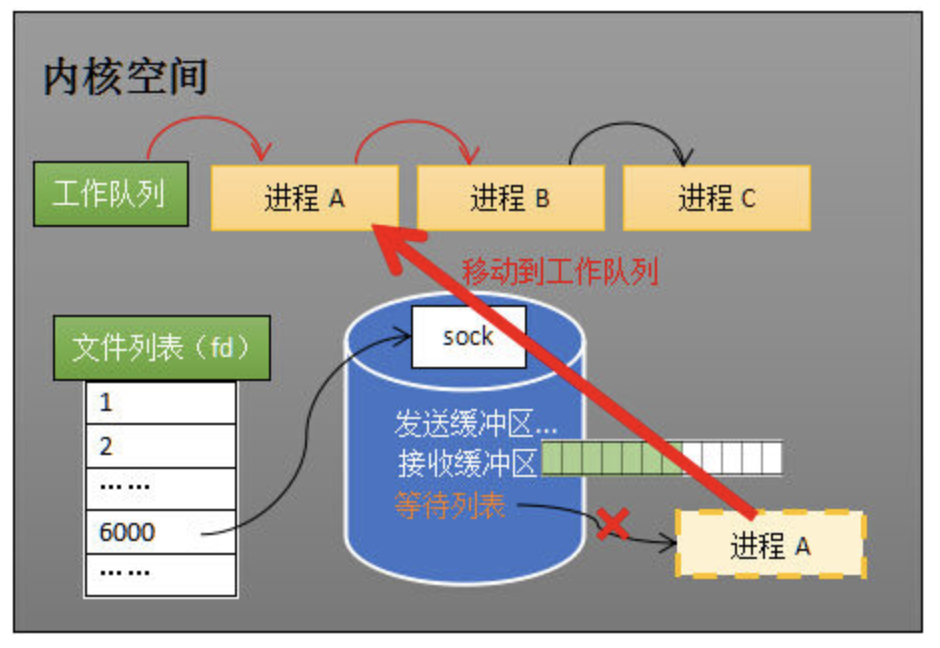

## Epoller的介绍

epoll是I/O多路复用技术的一种，目前常用的I/O多路复用技术有：epoll、select、poll。

I/O多路复用技术可以让服务器同时监听多个客户端发起的socket连接。epoll相较于select和poll，由于其底层的红黑树，不仅可以知道是否有socket通信状态发生了改变，还能够知道有几个socket发生了状态改变。不需要在程序中使用循环遍历所有的socket连接，确定到底是哪一个socket状态发生了改变。这一特点大大提高了服务器监听的效率，也让epoll成为了目前I/O多路复用技术的主流。

触发模式: 水平触发与边缘触发
水平触发的主要特点是，如果用户在监听epoll事件，当内核有事件的时候，会拷贝
给用户态事件，但是如果用户只处理了一次，那么剩下没有处理的会在下一次
epoll_wait再次返回该事件。

这样如果用户永远不处理这个事件，就导致每次都会有该事件从内核到用户的拷
贝，耗费性能，但是水平触发相对安全，最起码事件不会丢掉，除非用户处理完毕;

边缘触发: 相对跟水平触发相反，当内核有事件到达， 只会通知用户一次，至于用
户处理还是不处理，以后将不会再通知。这样减少了拷贝过程，增加了性能，但是
相对来说，如果用户马虎忘记处理，将会产生事件丢的情况。

the pipline of receiving the data

计算机收到了对端传送的数据（步骤①）。数据经由网卡传送到内存（步骤②），然后网卡通过中断信号通知cpu有数据到达，cpu执行中断程序（步骤③）。此处的中断程序主要有两项功能，先将网络数据写入到对应socket的接收缓冲区里面（步骤④），再唤醒进程A（步骤⑤），重新将进程A放入工作队列中。



### SELECT
服务端需要管理多个客户端连接，而recv只能监视单个socket，这种矛盾下，人们开始寻找监视多个socket的方法。epoll的要义是高效的监视多个socket。从历史发展角度看，必然先出现一种不太高效的方法，人们再加以改进。只有先理解了不太高效的方法，才能够理解epoll的本质。
假如能够预先传入一个socket列表，如果列表中的socket都没有数据，挂起进程，直到有一个socket收到数据，唤醒进程。这种方法很直接，也是select的设计思想。
为方便理解，我们先复习select的用法。

先准备一个数组（下面代码中的fds），让fds存放着所有需要监视的socket。然后调用select，如果fds中的所有socket都没有数据，select会阻塞，直到有一个socket接收到数据，select返回，唤醒进程。用户可以遍历fds，通过FD_ISSET判断具体哪个socket收到数据，然后做出处理。

#### disadvantages:
其一，每次调用select都需要将进程加入到所有监视socket的等待队列，每次唤醒都需要从每个队列中移除。这里涉及了两次遍历，而且每次都要将整个fds列表传递给内核，有一定的开销。正是因为遍历操作开销大，出于效率的考量，才会规定select的最大监视数量，默认只能监视1024个socket。

其二，进程被唤醒后，程序并不知道哪些socket收到数据，还需要遍历一次。


与epoll相关的几个函数分别是：
```cpp
// 在内核中创建epoll对象
int epoll_create(int size); 
// 修改epoll中的fd属性：增删改
int epoll_ctl(int epfd, int op, int fd, struct epoll_event *event); 
// 监听socket
int epoll_wait(int epfd, struct epoll_event *events,
                      int maxevents, int timeout);
```

使用epoll的基本步骤：
- 调用epoll_create创建epoll对象
- 调用epoll_ctl向epoll中添加需要监听的socket
- 调用epoll_wait监听socket

使用epoll时操作较为频繁的便是向epoll中添加、修改、删除对象以及调用wait监听，我们在Epoller类中可以封装成不同功能的函数，便于在其他外部文件中快速的调用，减少直接调用epoll库函数输入大量参数以及不小心导致的传参错误情况发生

定义的几个函数：
```cpp
    // 成员函数
    int wait(int timeout = -1);
    bool add(int fd, uint32_t ev);
    bool mod(int fd, uint32_t ev);
    bool del(int fd);
```
使用epoll时，需要使用数组保存发生了改变的socket，这里使用vector容器来保存：
```cpp
    // Epoller对象中的epollfd文件描述符
    int m_epollFd;
    // 使用vector保存改变的事件
    std::vector<struct epoll_event> m_epEves;
```

完整的Epoller类如下：
```cpp
#ifndef __EPOLLER_H__
#define __EPOLLER_H__
#include <unistd.h>
#include <sys/epoll.h>
#include <stdio.h>
#include <vector>
class Epoller
{
public:
    explicit Epoller(int maxevents = 1024);
    ~Epoller();
    // 成员函数
    int wait(int timeout = -1);
    bool add(int fd, uint32_t ev);
    bool mod(int fd, uint32_t ev);
    bool del(int fd);
    //对外要使用的接口
    int getSockFd(int i) const;
    uint32_t getFdEvent(int i) const;

private:
    // Epoller对象中的epollfd文件描述符
    int m_epollFd;
    // 使用vector保存改变的事件
    std::vector<struct epoll_event> m_epEves;
};
#endif
```