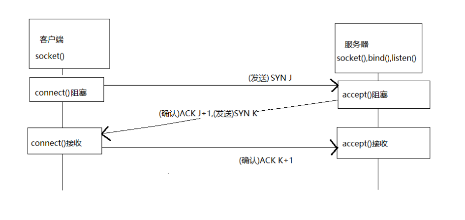

## webserver介绍

这个webserver类是对整个web服务器的抽象。在这个类中，调用之前编写的四大模块：Httpconnection类、Epoller类、Timer类以及ThreadPool类完成整个服务器项目的功能。
establish 

socket connection;
epoller is used to listen the io;
timeManager is used to manage the http connection which is a time node;
#### the connection of socket

### webserver的逻辑

第一步是服务器的初始化。在webserver的构造函数中完成对Httpconnection类、Epoller类、Timer类以及ThreadPool类对象的初始化，同时还需要设置好服务器的socket，暴露端口等相关信息

```cpp
    m_port = port;
    initEventMode(trigMode);
    m_timeoutMs = timeoutMS;
    m_openLinger = optLinger;
    m_pool = std::make_unique<Threadpool>(threadNum);
    m_timer = std::make_unique<TimeManager>();
    m_epoller = std::make_unique<Epoller>();
    m_isclose = (initSocket() ? false : true);
```
本项目是使用I/O多路复用技术中的epoll，在初始化socket的过程中，将m_listenFd加入中epoll池中。同时，也将监听socket的行为(是否有新的连接)和监听每一个HTTP连接的行为(已经建立的连接有无IO请求)统一起来了。在每一次直接处理所有的epoll就绪事件时，通过就绪事件的fd可以区分开新连接和I/O请求，并对两种不同的情况分别处理。

第二步是开始处理HTTP连接。

一开始要先清理过期的连接，并且得到下一次处理的时间。这里使用Timer指针调用Timer类对象的`getNextHandle()`函数：
```cpp
    timeMs = m_timer->getNextHandle();
```

将得到的时间传递给epoll_wait函数作为时间参数，经过相应的时间等待后，得到发生改变的事件，用一个循环处理所有的epoll就绪事件。在过程中需要分两种类型：收到新的HTTP请求和其他的读写请求。

1. 收到新的HTTP请求的情况

在fd==m_listenFd的时候，也就是收到新的HTTP请求的时候，需要调用函数
```cpp
    void handleListen();
```
2. 已经建立连接的HTTP发来IO请求的情况

这种情况下，必然需要提供读写的处理，用下述两个函数完成：
```cpp
    void handleWrite(Httpconnection *client);
    void handleRead(Httpconnection *client);
```
为了提高性能，使用了线程池，所以这两个函数就是将读写的底层实现函数加入到线程池，两个读写的底层实现函数为：
```cpp
    void onRead(HTTPconnection* client);
    void onWrite(HTTPconnection* client);
```
听到这里大家也许有点懵？这个读和写的过程在webServer类中，是这样的：
- 读：
调用handleWrite-->将onRead函数扔给线程池去执行
而onRead函数是调用Httpconnection对象的读取函数，而Httpconnection的读取函数实际上是Buffer类对象的读取函数的封装
简而言之，在handleRead函数中，就是让线程池去执行Buffer对象中读取函数，获取通信的内容。在onRead函数中读取完成后，再调用Httpconnection的处理函数，将读取完的数据进行一个相应的处理，具体的处理过程可以查看我之前写的http的文档

- 写：
调用handleWrite-->将onWrite函数扔给线程池去执行
同onRead函数一样，在onWrite函数中，其核心函数是Buffer对象中的发送函数。在onWrite函数中，如果发送数据有错误产生的话，会根据错误号和发送数据的返回值，判断数据发送出现哪种问题：
    - 某些原因导致发送字节数 == 0：重新处理接收到数据，等待下一次的发送？
    - 返回值-1，进一步根据系统错误号判断：
        - 错误号为EAGAIN：重置为写状态，下一次epoll检测后，再次发送
        - 其他错误：直接关闭通信

epoll使用的是边缘触发ET，此外在读结束的时候根据需要改变epoll的事件。